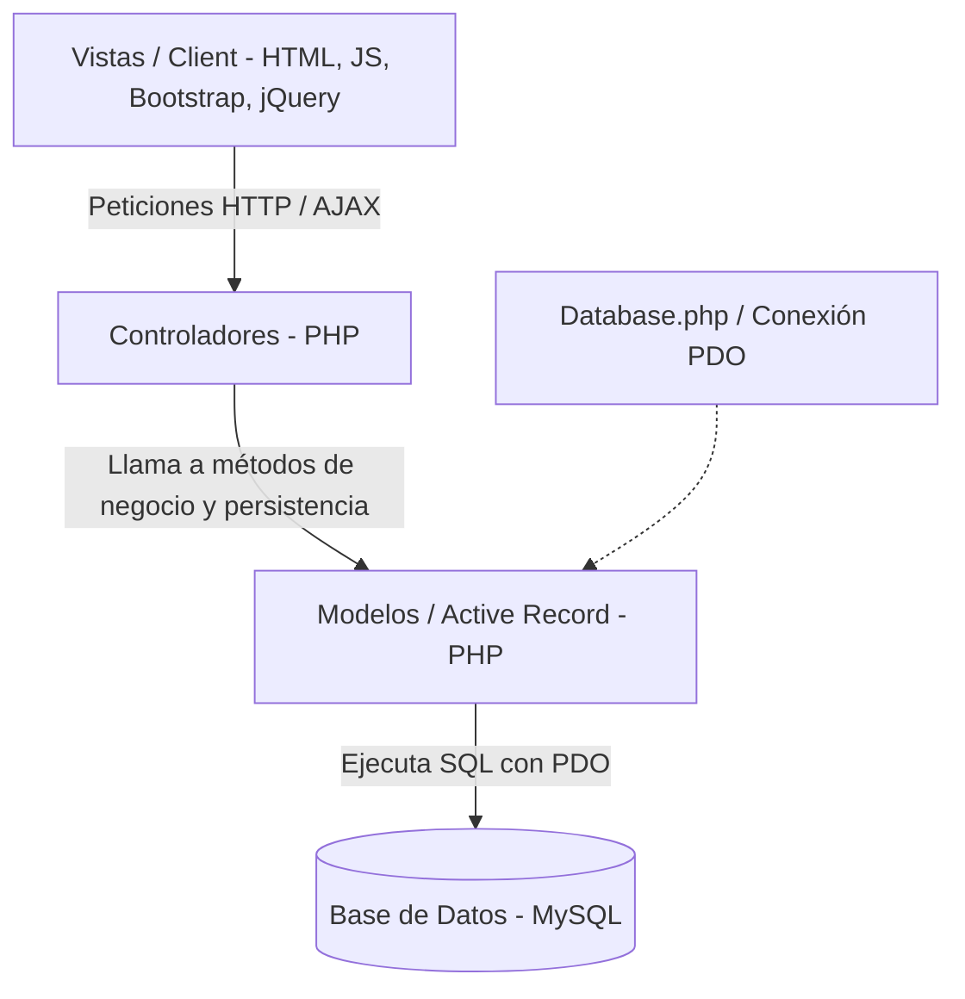
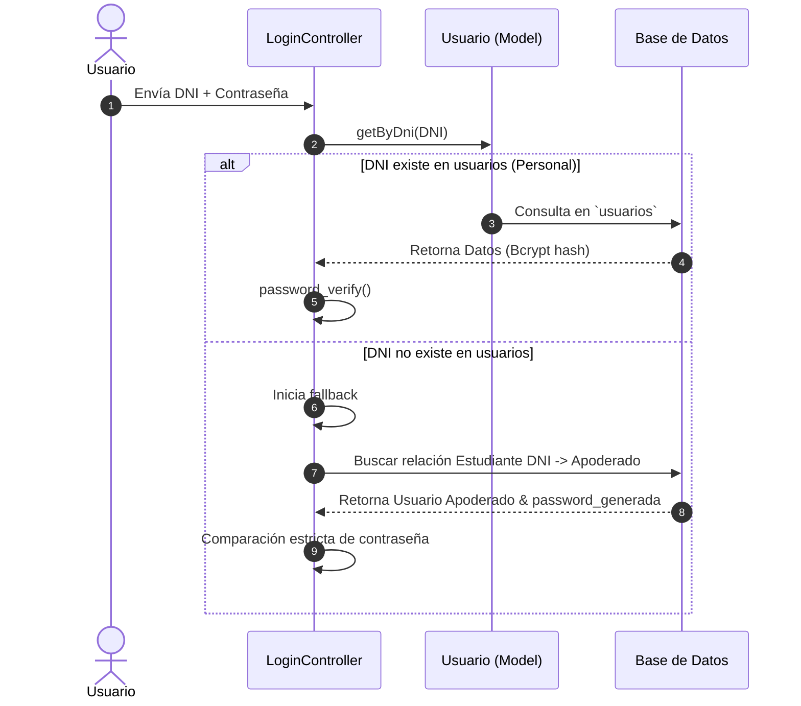
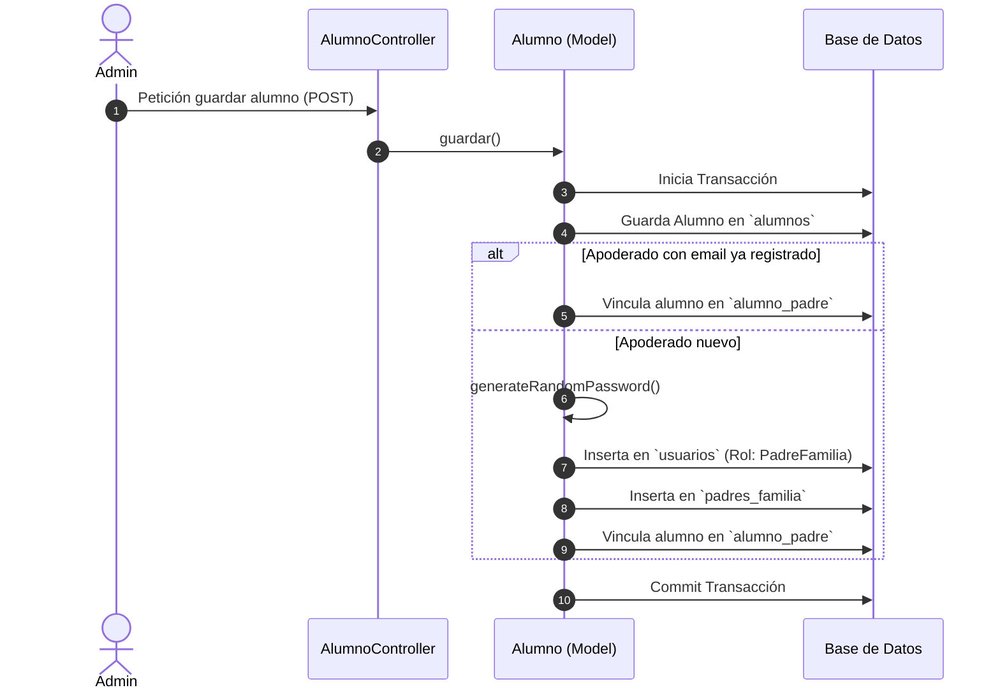

# SisHonores 1.0 - Sistema de Gestión Académica y Calificaciones

SisHonores es una plataforma web de gestión escolar diseñada para el **Colegio Matemático Honores**. Facilita la administración académica al integrar el control de matrículas, la asignación de docentes, la gestión de aulas y cursos, el ingreso de calificaciones y observaciones por competencias, y la generación de reportes oficiales en formato PDF y Excel. Además, provee un canal de comunicación directo para que los padres de familia consulten el rendimiento y observaciones académicas de sus hijos en tiempo real.

---

## 🏛️ Arquitectura del Sistema

El sistema está diseñado bajo el patrón arquitectónico **MVC (Modelo-Vista-Controlador)** utilizando el patrón **Active Record** para la persistencia, estructurado en las siguientes capas:



### Capas del Proyecto:
1. **Capa de Datos / Utilidades (`/util`)**: Define la clase [Database](file:///c:/xampp/htdocs/sishonores-1/util/Database.php#L4) encargada de establecer y gestionar la conexión única y persistente mediante **PDO** (PHP Data Objects), asegurando transacciones seguras y el manejo de excepciones de base de datos.
2. **Capa del Modelo (`/model`)**: Clases PHP que consolidan tanto los atributos del dominio (propiedades de negocio) como el comportamiento de persistencia (consultas SQL de inserción, actualización, eliminación y listado). Cada modelo recibe opcionalmente una instancia de la conexión a base de datos PDO (ej. `new Alumno($db)`).
3. **Capa de Controladores (`/controller`)**: Actúan como intermediarios. Validan los parámetros recibidos mediante solicitudes HTTP (GET/POST), aplican las reglas de negocio necesarias e interactúan directamente con la persistencia en los Modelos correspondientes (ej. `$alumno->guardar()`), retornando respuestas en formato **JSON** para consumo asíncrono.
4. **Capa de Vistas (`/vista`)**: La interfaz gráfica de usuario segmentada según el rol del usuario autenticado en sesión (`super_admin`, `docente`, `padre`, `secretaria`). Emplea plantillas comunes (`includes/header.php`, `includes/sidebar.php`, `includes/footer.php`) para mantener consistencia visual.

---

## 🛠️ Tecnologías Utilizadas

- **Servidor y Backend**:
  - PHP 7.4 o superior.
  - Programación Orientada a Objetos (POO).
  - PHP Sessions para el control de autenticación y roles de usuario.
- **Base de Datos**:
  - MySQL / MariaDB.
  - PDO para consultas parametrizadas contra inyecciones SQL y transacciones seguras.
- **Frontend y Diseño**:
  - HTML5 & CSS3 (estilos personalizados en [style.css](file:///c:/xampp/htdocs/sishonores-1/css/style.css)).
  - Bootstrap 5.1.3 (Framework CSS adaptativo).
  - FontAwesome 6.0.0 (iconografía técnica).
  - JavaScript Vanilla & jQuery 3.6.0 para peticiones AJAX dinámicas y control de eventos.
- **Exportaciones y Reportes**:
  - **PDF**: Generación asíncrona mediante estilos de impresión del navegador (`window.print()`), prescindiendo de dependencias externas.
  - **Excel**: Generación nativa a través de cabeceras HTTP (`Content-Type: application/vnd.ms-excel`) y renderizado de tablas HTML estructuradas en archivos `.xls`.

---

## 🚀 Guía de Instalación y Configuración

Siga los siguientes pasos para levantar el entorno de desarrollo local utilizando **XAMPP** en Windows:

### Requisitos Previos:
- XAMPP instalado (PHP >= 7.4 y MySQL/MariaDB).
- Servidor web Apache activo.

### Pasos para la Configuración:

1. **Clonar o Copiar el Proyecto**:
   Coloque el directorio del proyecto en la carpeta raíz del servidor local de XAMPP:
   ```bash
   C:\xampp\htdocs\sishonores-1\
   ```

2. **Configuración de la Base de Datos**:
   - Abra el panel de control de XAMPP e inicie los servicios de **Apache** y **MySQL**.
   - Acceda a `phpMyAdmin` en su navegador: [http://localhost/phpmyadmin/](http://localhost/phpmyadmin/).
   - Cree una nueva base de datos llamada `honoresbd` con el cotejamiento `utf8_spanish2_ci`.
   - Vaya a la pestaña **Importar**, seleccione el archivo de volcado ubicado en el proyecto en: [honoresbd.sql](file:///c:/xampp/htdocs/sishonores-1/sql/honoresbd.sql) y haga clic en **Importar** (Ejecutar).

3. **Verificar Conexión de Base de Datos**:
   - Conexión configurada en [Database.php](file:///c:/xampp/htdocs/sishonores-1/util/Database.php). Por defecto:
     ```php
     private $host = "localhost";
     private $db_name = "honoresbd";
     private $username = "root";
     private $password = "";
     ```

4. **Acceder a la Aplicación**:
   - Ingrese a la siguiente URL desde el navegador: [http://localhost/sishonores-1/](http://localhost/sishonores-1/)
   - El sistema le redirigirá de manera automática al módulo de inicio de sesión (`vista/login.php`).

---

## 📦 Documentación de Modelos

Ubicados en la carpeta `/model`, cada uno de estos archivos maneja su propia estructura y persistencia:

- 📄 [Alumno.php](file:///c:/xampp/htdocs/sishonores-1/model/Alumno.php): Modela los datos del estudiante y encapsula transaccionalmente su matrícula y la autogeneración de la cuenta de apoderado.
- 📄 [Usuario.php](file:///c:/xampp/htdocs/sishonores-1/model/Usuario.php): Gestiona el personal (docentes, secretarias, administradores, directores) y la vinculación de docentes a sus niveles de enseñanza.
- 📄 [AsignacionDocente.php](file:///c:/xampp/htdocs/sishonores-1/model/AsignacionDocente.php): Modela y valida las asignaciones escolares vinculando docentes, cursos y aulas.
- 📄 [Aula.php](file:///c:/xampp/htdocs/sishonores-1/model/Aula.php): Controla el registro de salones por grado, sección y vacantes.
- 📄 [Curso.php](file:///c:/xampp/htdocs/sishonores-1/model/Curso.php): Estructura las asignaturas escolares por nivel educativo.
- 📄 [Nota.php](file:///c:/xampp/htdocs/sishonores-1/model/Nota.php): Procesa y persiste notas, promedio final cualitativo/cuantitativo y comentarios de retroalimentación pedagógica.
- 📄 [Competencia.php](file:///c:/xampp/htdocs/sishonores-1/model/Competencia.php): DTO para representar las competencias de las áreas académicas.

---

## 🔄 Flujos de Datos Clave

### A. Autenticación y Fallback de Apoderados


### B. Matrícula y Creación de Credenciales del Apoderado

